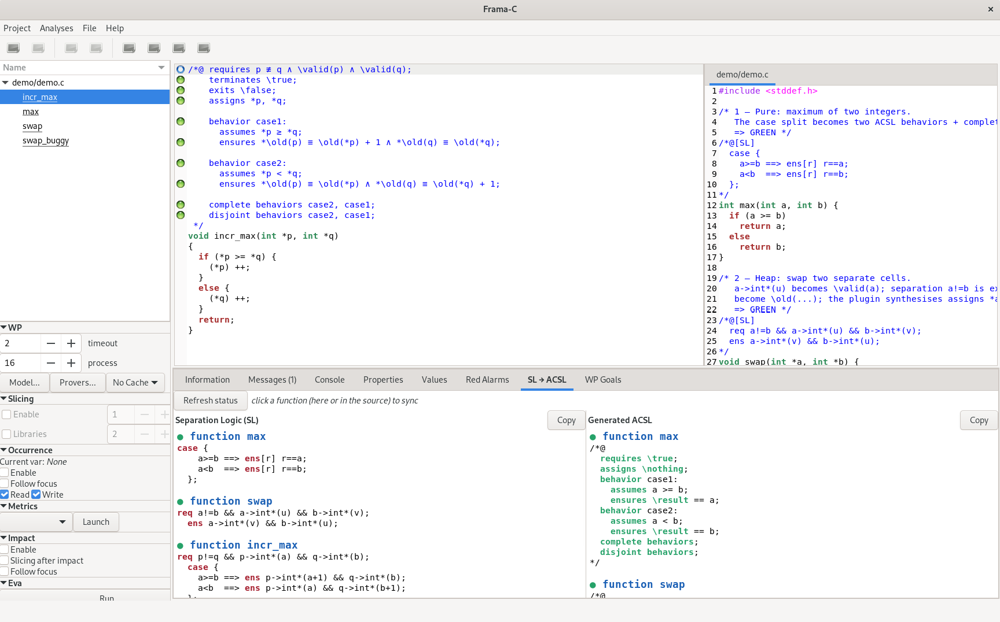
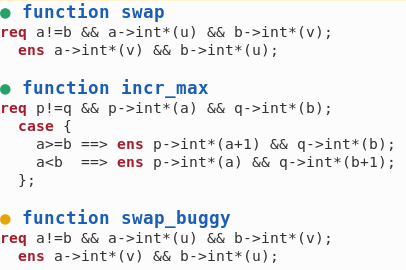
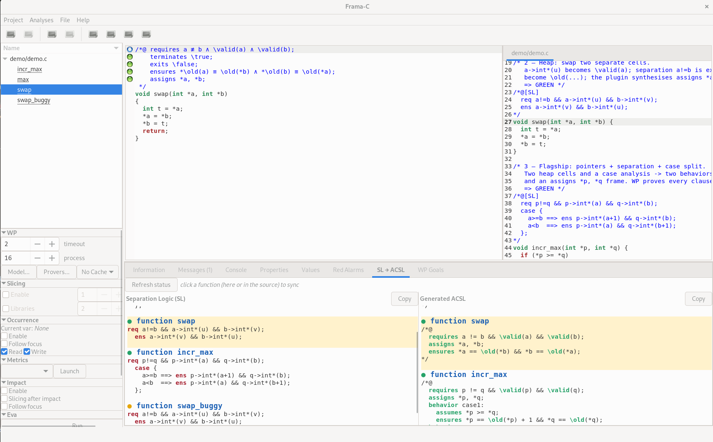
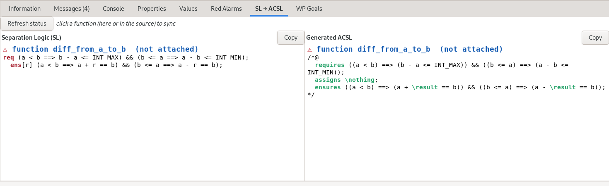
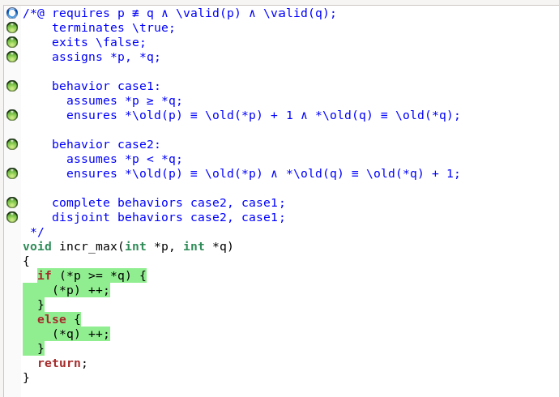

# The SL → ACSL Bridge : User Manual

*A guide to writing separation-logic (SL) specifications and verifying them with Frama-C/WP.*

This manual is the **user-facing** companion to the report
*"A report and documentation of the ACSL–SL Bridge"* (`acsl_sl_bridge.pdf`), which documents the
internal translation pipeline. Here we focus on **how to use the tool**: the SL syntax you write,
the command-line interface, the Frama-C GUI, and a full appendix of worked translations.

---

## Table of contents

1. [Introduction](#1-introduction)
2. [The SL language](#2-the-sl-language)
3. [Installation](#3-installation)
4. [Command-line usage](#4-command-line-usage)
5. [Graphical usage (Frama-C GUI)](#5-graphical-usage-frama-c-gui)
6. [How it works (overview)](#6-how-it-works-overview)
7. [Known limitations](#7-known-limitations)
8. [Appendix A : Example translations](#appendix-a--example-translations)

---

## 1. Introduction

Specification languages let you describe and verify the functional correctness of a program.
This project provides a **translation from Separation Logic (SL) to ACSL**. The two languages sit
at different levels of expressiveness, SL is well suited to writing concise specifications about
heap and pointers, while **ACSL** is the annotation language understood by widely-used verifiers
such as Frama-C/WP. Translating SL into ACSL is non-trivial because the two differ in syntax and
in how much they make explicit.

You write a contract in a compact SL language inside a special `/*@[SL] ... */` comment:

```c
/*@[SL]
  req p->int*(a);
  ens p->int*(a+1);
*/
void inc(int *p) { (*p)++; }
```

and the tool produces the equivalent ACSL contract that WP can verify:

```c
/*@ requires \valid(p);
    assigns *p;
    ensures *p == \old(*p) + 1; */
```

There are **two front ends** for the *same* translation:

| Front end | Command | What it does |
|---|---|---|
| **Frama-C plugin** *(recommended)* | `frama-c -sl file.c` | Parses the SL in-process and attaches a native ACSL contract, so `frama-c -sl -wp file.c` verifies directly: no intermediate file. |
| **Standalone CLI** | `dune exec ./src/main.exe -- file.c` | Translates `file.c` → `file_acsl.c` on disk; you then run Frama-C on the output (automated by `sl_to_acsl.sh`). |

---

## 2. The SL language

An SL specification lives in a `/*@[SL] ... */` comment placed **directly above** the entity it
describes, a function definition, or a `for`/`while` loop inside a function body.

### 2.1 Clauses

| SL clause | Meaning | ACSL it produces |
|---|---|---|
| `req <formula>;` | precondition | `requires <formula>;` |
| `ens <formula>;` | postcondition | `ensures <formula>;` |
| `ens[r] ... r ...;` | postcondition naming the return value `r` | `ensures ... \result ...;` |
| `case { c1 ==> ens …; c2 ==> ens …; };` | case split | one `behavior` per branch + `complete`/`disjoint behaviors;` |
| `Term[e];` | loop measure / termination | `loop variant e;` (also marks the block as a *loop* contract) |
| `Term[];` | termination marker with no measure | (function-level termination; no variant emitted) |

### 2.2 Heap and pointers (spatial notation)

| SL atom | Meaning | ACSL |
|---|---|---|
| `p->int*(v)` | `p` points to an `int` cell holding value `v` | `\valid(p)` (and `v` is the cell's contents) |
| `p->int*(lo, hi)` | `p` points to the array segment `p[lo..hi]` | `\valid(p + (lo .. hi))` |
| `p->int*(lo, hi)@I` | same, but **read-only** (immutable region) | `\valid_read(p + (lo .. hi))` |
| `a && b` between heaplets | separating conjunction (disjoint cells) | pointer inequalities (`a != b`) + the `assigns` frame |

Writing two separate cells (e.g. `a->int*(u) && b->int*(v)`) implies `a` and `b` are **separate**,
which the translator makes explicit as `a != b` and uses to compute the `assigns` clause.

### 2.3 Pre/post state: prime and `\old`

A postcondition often needs to relate the **after** value to the **before** value.

* `\old(e)` / `@`-notation refers to the pre-state value (function contracts).
* The **prime** form `x'` refers to the *post* value of `x`; an unprimed `x` in the same ensures is
  the *pre* value. Inside a **loop**, the pre/loop-entry value is rendered with
  `\at(x, LoopEntry)`.

The three canonical shapes, taken directly from the report:

**Pointer (spatial) notation**

```c
/*@[SL]                     /*@
  req a->int*(u);     ==>     requires \valid(a);
  ens a->int*(u);            assigns *a;
*/                            ensures *a == \old(*a);
                            */
```

**Case notation**

```c
/*@[SL]                                          /*@
  req p->int*(a) && q->int*(b);                    requires p != q && \valid(p) && \valid(q);
  case {                                           assigns *p, *q;
    a>=b ==> ens p->int*(a+1) && q->int*(b);       behavior case1:
    a<b  ==> ens p->int*(a) && q->int*(b+1);  ==>    assumes *p >= *q;
  };                                                 ensures *p == \old(*p) + 1 && *q == \old(*q);
*/                                                 behavior case2:
                                                     assumes *p < *q;
                                                     ensures *p == \old(*p) && *q == \old(*q) + 1;
                                                   complete behaviors;
                                                   disjoint behaviors;
                                                 */
```

**Loop notation** : prime notation in SL (e.g. `i'`, `a'`) induces ACSL references to
`\at(·, LoopEntry)` in the loop invariant:

```c
/*@[SL]                          /*@
  req i<=10 && Term[10-i];         loop invariant i <= 10;
  ens i'==10 && a'==a+(i'-i); ==>  loop invariant a == \at(a, LoopEntry) + (i - \at(i, LoopEntry));
*/                                 loop assigns a, i;
                                   loop variant 10 - i;
                                 */
```

> A loop **contract** specifies the entire effect of the loop as a relation between its entry and
> exit states; an **invariant** must hold at *every* iteration. The translator "lifts" the contract
> into an invariant by anchoring values to `LoopEntry` and splitting the working domain into a
> processed prefix and an unprocessed suffix (see the report, §4.3.3, for the full reasoning).

See [Appendix A](#appendix-a--example-translations) for the complete set of worked examples.

---

## 3. Installation

Everything lives in an opam switch. Install the toolchain once:

```bash
opam install dune menhir frama-c alt-ergo
why3 config detect            # let WP discover provers (z3 / alt-ergo)
```

**Before running anything**, activate the opam switch that has Frama-C so that `dune`, `frama-c`,
and `ocamlfind` are on your `PATH`:

```bash
eval $(opam env)                       # current switch
# or, if Frama-C is in another switch:
opam switch <name> && eval $(opam env)
```

Verify with `frama-c -version` (expect **32.x, Germanium**).

Install the `-sl` plugin into the Frama-C plugin path (once, and after editing plugin sources):

```bash
./install_sl.sh
```

This builds and `dune install`s the `frama-c-sl` package, then writes the discovery files so that
Frama-C (CLI and GUI) auto-load the plugin.

---

## 4. Command-line usage

### 4.1 Frama-C plugin (`-sl`) : recommended

```bash
frama-c -sl file.c                 # parse SL and attach the ACSL contract
frama-c -sl -print file.c          # ...and print each function with its attached contract
frama-c -sl -wp file.c             # ...and verify it with WP
frama-c -sl -wp -wp-no-simpl -wp-no-let file.c    # more readable WP goals
```

Example:

```text
$ frama-c -sl -wp test/system_test/incr_max/incr_max_spatial.c
[sl] attached SL contract to incr_max
[wp] Proved goals:    8 / 8
```

Loop specifications attach as `loop invariant/assigns/variant` on the loop statement and are used by
WP automatically:

```text
$ frama-c -sl -wp test/system_test/zero_array/zero_array.c
[sl] attached SL contract to all_zero_array
[sl] attached loop annotations to all_zero_array
[wp] Proved goals:   15 / 15
```

**Show the translation.** To print each SL block next to its generated ACSL (the console
equivalent of the GUI tab), add `-sl-show`:

```bash
frama-c -sl -sl-show file.c
```

```text
------------------------------------------------------------
[SL]
req p->int*(a);
ens p->int*(a+1);
------------------------------------------------------------
[ACSL]
/*@ requires \valid(p);
    assigns *p;
    ensures *p == \old(*p) + 1; */
------------------------------------------------------------
```

**Dev loop without installing.** `run_sl.sh` builds the plugin in `_build` and loads it with
`-load-module`, so you don't have to re-install while iterating:

```bash
./run_sl.sh -wp test/system_test/additional_tests/pure/max2/max2.c
```

### 4.2 Standalone CLI

Translate only (writes `<name>_acsl.c` next to the input and echoes it):

```bash
dune exec ./src/main.exe -- test/system_test/abs_diff/abs_diff.c
```

Translate **and** run Frama-C/WP in one step:

```bash
./sl_to_acsl.sh test/system_test/incr_max/incr_max_spatial.c          # CLI
./sl_to_acsl.sh --gui test/system_test/incr_max/incr_max_spatial.c    # Frama-C GUI
```

> **When to prefer the standalone CLI:** specs that use `<limits.h>` macros (`INT_MAX`/`INT_MIN`)
> or the prime (`'`) notation can trip Frama-C's preprocessing in the plugin path (see
> [§7](#7-known-limitations)). The standalone CLI reads the raw source and always translates them;
> Frama-C then preprocesses the generated `_acsl.c`.

---

## 5. Graphical usage (Frama-C GUI)

Launch the GUI with the plugin enabled (add `-wp` to run the prover too):

```bash
frama-c-gui -sl -wp file.c
```

The lower notebook (next to *Information* / *Messages* / *Console*) gains an **“SL → ACSL”** tab
showing, per function, the original separation-logic block (left) beside the generated ACSL
contract (right), evenly split, word-wrapped, with keywords highlighted and a **Copy** button per
side.



**Proof-status bullets.** Each function header carries a colored bullet:

| Bullet | Meaning |
|---|---|
| ● green | proved by WP |
| ● red | invalid / inconsistent |
| ● orange | unknown (e.g. prover timeout) |
| ○ grey | not yet attempted |



Run WP, then press **Refresh status** in the tab's toolbar to re-query and repaint the bullets.

**Synced with the source.** The two views are linked to the main source view:

* Click a function in the main source view → its SL block *and* its ACSL block are highlighted and
  scrolled into view in the tab.
* Click a block in the tab → the source view jumps to that function.



**Honest "not attached" marking.** If a function's generated ACSL fails to type/attach (for example
a spec using the `<limits.h>` macro `INT_MAX`), the header is flagged with **⚠ (not attached)** and
a red bullet. The generated ACSL is still shown for inspection, but no contract was attached to the
function, so the source window will only show Frama-C's default contract.



The proof bullets that Frama-C draws in the **source view** (in the left margin next to each clause)
show WP results as usual.



---

## 6. How it works (overview)

Both front ends share the same translation chain; only the back end differs (write a file vs. attach
in-process):

```
SL block text
  → Sl_parser / Sl_lexer        → Sl_ast.spec        (parse the SL surface syntax)
  → Sl_to_core.sl_to_core       → Core.spec          (neutral intermediate representation)
  → Core_to_acsl.spec_to_acsl   → ACSL contract text  (pretty-print ACSL)
  ── standalone CLI: write <name>_acsl.c
  └─ plugin: Logic_lexer/Logic_typing → attach as a native funspec / loop annotation
```

The **Core** intermediate representation normalizes syntactic sugar (`\old`, prime, aliases),
separates heap reasoning from pure reasoning, and distinguishes function contracts from loop
contracts, which is what makes the final ACSL emission straightforward. For a module-by-module
account of the translator internals, see Hrishiraj Mandal's report (`acsl_sl_bridge.pdf`), §§5–6.

---

## 7. Known limitations

* **Loop contracts are supported.** An SL block placed directly above a `for`/`while` loop is
  translated to `loop invariant/assigns/variant` and attached to the loop statement (e.g.
  `zero_array` proves 15/15, matching the standalone CLI). A block is routed to a loop or a function
  contract by whichever (loop statement / function definition) appears nearest below it.
* **Prime (`'`) notation and Frama-C preprocessing.** Frama-C runs its annotation preprocessor over
  `/*@ ... */` comments, and a stray `'` (used by some loop specs, e.g. `i'`) can be read as an
  unterminated character literal, aborting *before* the plugin runs. Use the non-prime variants
  (`\old`, aliases) with the plugin, or use the **standalone CLI**, which reads the raw source and
  handles `'` directly.
* **`<limits.h>` macros** (`INT_MAX`, `INT_MIN`): not expanded for the plugin, so they fail typing
  (e.g. `abs_diff`) and are shown as **“(not attached)”** in the GUI. The standalone CLI handles them
  because Frama-C preprocesses the generated `_acsl.c`.
* **Bare mutable scalars** (e.g. a global counter) are treated as timeless logical variables, not as
  mutable state, so `g' == g + 1` collapses to a contradiction, see the `global_counter`
  known-gap example in the appendix.
* **Recursive / inductive predicates** (`x::ll<n>`): not supported by the current SL language; only
  the flat fragment (single cells `p->int*(v)`, array ranges, arithmetic, case-splits) is translated.
* The plugin maps an SL block to the nearest function/loop defined below it (the
  spec-directly-above convention used throughout the examples).

---

## Appendix A : Example translations

Every example below lives under `test/system_test/`, paired as `<name>.c` (the SL input) and
`<name>_acsl.c` (the generated ACSL, used as the golden output in the test suite). The translation
shown is what *both* front ends produce.

### A.1 Pure / arithmetic (no heap)

#### `safe_div` : simple require/ensure

SL input:

```c
/*@[SL]
  req b > 0 && a >= 0;
  ens[r] r == a / b;
*/
int safe_div(int a, int b) { return a / b; }
```

Generated ACSL:

```c
/*@
  requires b > 0 && a >= 0;
  assigns \nothing;
  ensures \result == a / b;
*/
```

#### `max2` : case split → two behaviors

SL input:

```c
/*@[SL]
  case {
    a>=b ==> ens[r] r==a;
    a<b  ==> ens[r] r==b;
  };
*/
int max2(int a, int b) { if (a >= b) return a; else return b; }
```

Generated ACSL:

```c
/*@
  requires \true;
  assigns \nothing;
  behavior case1:
    assumes a >= b;
    ensures \result == a;
  behavior case2:
    assumes a < b;
    ensures \result == b;
  complete behaviors;
  disjoint behaviors;
*/
```

#### `sign` : three-way case split

SL input:

```c
/*@[SL]
  case {
    x>0  ==> ens[r] r==1;
    x==0 ==> ens[r] r==0;
    x<0  ==> ens[r] r==-1;
  };
*/
int sign(int x) { if (x > 0) return 1; if (x < 0) return -1; return 0; }
```

Generated ACSL:

```c
/*@
  requires \true;
  assigns \nothing;
  behavior case1:
    assumes x > 0;
    ensures \result == 1;
  behavior case2:
    assumes x == 0;
    ensures \result == 0;
  behavior case3:
    assumes x < 0;
    ensures \result == -1;
  complete behaviors;
  disjoint behaviors;
*/
```

#### `abs_diff` : implications + `<limits.h>` macros (plugin: *not attached*; use the CLI)

SL input:

```c
#include <limits.h>
/*@[SL]
  req (a < b ==> b - a <= INT_MAX) && (b <= a ==> a - b <= INT_MIN);
  ens[r] (a < b ==> a + r == b) && (b <= a ==> a - r == b);
*/
int diff_from_a_to_b(int a, int b) {
    if (a < b) return b - a; else return a - b;
}
```

Generated ACSL:

```c
/*@
  requires ((a < b) ==> (b - a <= INT_MAX)) && ((b <= a) ==> (a - b <= INT_MIN));
  assigns \nothing;
  ensures ((a < b) ==> (a + \result == b)) && ((b <= a) ==> (a - \result == b));
*/
```

### A.2 Single-cell heap (pointers, separation)

#### `inc` : one cell

SL input:

```c
/*@[SL]
  req p->int*(a);
  ens p->int*(a+1);
*/
void inc(int *p) { (*p)++; }
```

Generated ACSL:

```c
/*@
  requires \valid(p);
  assigns *p;
  ensures *p == \old(*p) + 1;
*/
```

#### `swap` : two separate cells

SL input:

```c
/*@[SL]
  req a->int*(u) && b->int*(v);
  ens a->int*(v) && b->int*(u);
*/
void swap(int* a, int* b) { int tmp = *a; *a = *b; *b = tmp; }
```

Generated ACSL:

```c
/*@
  requires \valid(a) && \valid(b);
  assigns *a, *b;
  ensures *a == \old(*b) && *b == \old(*a);
*/
```

#### `rotate3` : three separate cells

SL input:

```c
/*@[SL]
  req a!=b && b!=c && a!=c && a->int*(u) && b->int*(v) && c->int*(w);
  ens a->int*(w) && b->int*(u) && c->int*(v);
*/
void rotate3(int *a, int *b, int *c) { int t = *a; *a = *c; *c = *b; *b = t; }
```

Generated ACSL:

```c
/*@
  requires a != b && a != c && b != c && \valid(a) && \valid(b) && \valid(c);
  assigns *a, *b, *c;
  ensures *a == \old(*c) && *b == \old(*a) && *c == \old(*b);
*/
```

### A.3 Heap + case split

#### `incr_max` : pointers, separation, and a case split

SL input:

```c
/*@[SL]
  req p!=q && p->int*(a) && q->int*(b);
  case {
    a>=b ==> ens p->int*(a+1) && q->int*(b);
    a<b  ==> ens p->int*(a) && q->int*(b+1);
  };
*/
void incr_max(int *p, int *q) { if (*p >= *q) (*p)++; else (*q)++; }
```

Generated ACSL:

```c
/*@
  requires p != q && \valid(p) && \valid(q);
  assigns *p, *q;
  behavior case1:
    assumes *p >= *q;
    ensures *p == \old(*p) + 1 && *q == \old(*q);
  behavior case2:
    assumes *p < *q;
    ensures *p == \old(*p) && *q == \old(*q) + 1;
  complete behaviors;
  disjoint behaviors;
*/
```

### A.4 Loops

Each example has a function contract **and** an inner loop contract.

#### `for` (`add_ten`) : accumulator loop

SL input:

```c
/*@[SL]
    ens[r] r == a + 10;
*/
int add_ten(int a){
  /*@[SL]
    req i<=10 && Term[10-i];
    ens i'==10 && a'==a+(i'-i);
  */
  for (int i = 0; i < 10; ++i) ++a;
  return a;
}
```

Generated ACSL:

```c
/*@
  requires \true;
  assigns \nothing;
  ensures \result == a + 10;
*/
int add_ten(int a){
  /*@
  loop invariant i <= 10;
  loop invariant a == \at(a, LoopEntry) + (i - \at(i, LoopEntry));
  loop assigns a, i;
  loop variant 10 - i;
*/
  for (int i = 0; i < 10; ++i) ++a;
  return a;
}
```

#### `zero_array` (`all_zero_array`) : read-only scan, returns a flag

SL input:

```c
/*@[SL]
  req (n >= 0) && t->int*(0, n-1);
  ens (\result != 0) <==> (\forall integer j. (0 <= j && j < n) ==> t[j] == 0);
*/
int all_zero_array(const int *t, int n) {
  int k = 0;
  /*@[SL]
    req (0 <= k && k <= n) && (\forall integer j. (0 <= j && j < k) ==> t[j] == 0) && Term[n - k];
    ens (0 <= k' && k' <= n);
  */
  while (k < n) { if (t[k] != 0) return 0; k++; }
  return 1;
}
```

Generated ACSL:

```c
/*@
  requires n >= 0 && \valid(t + (0 .. n - 1));
  assigns t[0 .. n - 1];
  ensures ((\result != 0) ==> (\forall integer j; (0 <= j && j < n) ==> (t[j] == 0)))
       && ((\forall integer j; (0 <= j && j < n) ==> (t[j] == 0)) ==> (\result != 0));
*/
int all_zero_array(const int *t, int n) {
  int k = 0;
  /*@
  loop invariant 0 <= k;
  loop invariant k <= n;
  loop invariant \forall integer j; (0 <= j && j < k) ==> (t[j] == 0);
  loop assigns k;
  loop variant n - k;
*/
  while (k < n) { if (t[k] != 0) return 0; k++; }
  return 1;
}
```

#### `mutable_arrays` (`reset`) : write the whole array

SL input:

```c
/*@[SL]
    req array->int*(0,length-1) && Term[];
    ens \forall size_t j. 0<=j<length ==> array[j]'==0;
*/
void reset(int* array, size_t length) {
    /*@[SL]
        req array->int*(i,length-1) && i<=length && Term[length-i];
        ens \forall size_t j. (i<=j<=length ==> array[j]'==0) && i'==length;
    */
    for (size_t i = 0; i < length; i++) array[i] = 0;
}
```

Generated ACSL:

```c
/*@
  requires \valid(array + (0 .. length - 1));
  assigns array[0 .. length - 1];
  ensures \forall size_t j; (0 <= j && j < length) ==> (array[j] == 0);
*/
void reset(int* array, size_t length) {
    /*@
  loop invariant i <= length;
  loop invariant 0 <= i;
  loop invariant \at(i, LoopEntry) <= i;
  loop invariant \forall size_t j; (i <= j && j < length) ==> (array[j] == \at(array[j], LoopEntry));
  loop invariant \forall size_t j; (\at(i, LoopEntry) <= j && j < i) ==> (array[j] == 0);
  loop assigns i, array[\at(i, LoopEntry) .. length - 1];
  loop variant length - i;
*/
    for (size_t i = 0; i < length; i++) array[i] = 0;
}
```

#### `read_only_arrays` (`search`) : read-only search returning a pointer

SL input:

```c
/*@[SL]
  req array->int*(0,length-1)@I && Term[];
  case {
    (\exists size_t off . 0<=off<length && array[off]==element) ==> ens[r] r>=array && r<array+length && *r==element;
    (\forall size_t off . (0<=off<length ==> array[off]!=element)) ==> ens[r] r==NULL;
  };
*/
int* search(int* array, size_t length, int element) {
  /*@[SL]
    req array->int*(0,length-1)@I && 0<=i<=length && Term[length-i] && \forall size_t j. (0<=j<i ==> array[j]!=element);
    ens i'==length || \return#(array+i') && array[i']==element /\0<=i'<length;
  */
  for (size_t i = 0; i < length; i++) { if (array[i] == element) return &array[i]; }
  return NULL;
}
```

Generated ACSL:

```c
/*@
  requires \valid_read(array + (0 .. length - 1));
  assigns \nothing;
  behavior case1:
    assumes \exists size_t off; 0 <= off && off < length && array[off] == element;
    ensures \result >= array && \result < array + length && *\result == element;
  behavior case2:
    assumes \forall size_t off; (0 <= off && off < length) ==> (array[off] != element);
    ensures \result == NULL;
  complete behaviors;
  disjoint behaviors;
*/
int* search(int* array, size_t length, int element) {
  /*@
  loop invariant 0 <= i;
  loop invariant i <= length;
  loop invariant \forall size_t j; (0 <= j && j < i) ==> (array[j] != element);
  loop invariant \at(i, LoopEntry) <= i;
  loop invariant \forall size_t j; (i <= j && j < length) ==> (array[j] == \at(array[j], LoopEntry));
  loop assigns i;
  loop variant length - i;
*/
  for (size_t i = 0; i < length; i++) { if (array[i] == element) return &array[i]; }
  return NULL;
}
```

#### `search_and_replace` (`search_replace`) : conditional in-place update

SL input:

```c
/*@[SL]
req array->int*(0,length-1) && Term[];
ens (\forall size_t j. (0<=j<length && array[j]==old ==> array[j]'==new))
 && (\forall size_t j. (0<=j<length && array[j]!=old ==> array[j]'==array[j]));
*/
void search_replace(int array[], size_t length, int old, int new) {
  /*@[SL]
  req array->int*(i,length-1) && Term[length - i];
  ens i' == length
    && (\forall size_t j. (i<=j<length && array[j]==old ==> array[j]'==new))
    && (\forall size_t j. (i<=j<length && array[j]!=old ==> array[j]'==array[j]));
  */
  for (size_t i = 0; i < length; ++i) { if (array[i] == old) array[i] = new; }
}
```

Generated ACSL:

```c
/*@
  requires \valid(array + (0 .. length - 1));
  assigns array[0 .. length - 1];
  ensures \forall size_t j; (0 <= j && j < length && \old(array[j]) == old) ==> (array[j] == new)
       && \forall size_t j; (0 <= j && j < length && \old(array[j]) != old) ==> (array[j] == \old(array[j]));
*/
void search_replace(int array[], size_t length, int old, int new) {
  /*@
  loop invariant 0 <= i;
  loop invariant i <= length;
  loop invariant \at(i, LoopEntry) <= i;
  loop invariant \forall size_t j; (i <= j && j < length) ==> (array[j] == \at(array[j], LoopEntry));
  loop invariant \forall size_t j; (\at(i, LoopEntry) <= j && j < i && \at(array[j], LoopEntry) == old) ==> (array[j] == new);
  loop invariant \forall size_t j; (\at(i, LoopEntry) <= j && j < i && \at(array[j], LoopEntry) != old) ==> (array[j] == \at(array[j], LoopEntry));
  loop assigns i, array[\at(i, LoopEntry) .. length - 1];
  loop variant length - i;
*/
  for (size_t i = 0; i < length; ++i) { if (array[i] == old) array[i] = new; }
}
```

### A.5 Known gap : `global_counter`

This example is **expected to fail** (WP: 2/4). A bare mutable scalar (the global `g`) is treated
as a timeless logical variable, so the frame is computed as `assigns \nothing` and `g' == g + 1`
collapses to the contradiction `g == g + 1`. It is kept as a documented limitation.

SL input:

```c
int g;
/*@[SL]
  ens g' == g + 1;
*/
void increase(void) { g = g + 1; }
```

Generated ACSL (defective by design):

```c
/*@
  requires \true;
  assigns \nothing;      /* should be: assigns g; */
  ensures g == g + 1;    /* g' (post) and g (pre) both collapsed to g */
*/
```

---

*This manual documents the user-facing behaviour. For the translation internals (Core IR, the
module-by-module pipeline, and the loop-lifting reasoning), see `acsl_sl_bridge.pdf`.*
